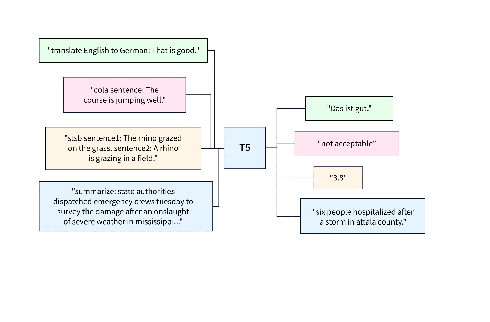

### T5 Transformer

This repository contains a custom implementation of the T5 (Text-To-Text Transfer Transformation) model using PyTorch. T5 is a state-of-the-art sequence-to-sequence model designed for text generation and transformation tasks, such as translation, summarization, and question-answering. The architecture is based on an encoder-decoder structure, with self-attention and cross-attention mechanisms to facilitate learning and transformation of sequences.

### Code Structure
- `src/model.py` - This is the core model code, containing all classes, cross attention and self-attention modules.
- `src/utils.py` - Utility functions, such as computing bias, and calculating relative buckets.

